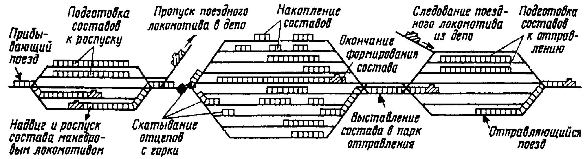

Программное средство по управлению эксплуатационными процессами на железнодорожной станции
=========================
[English](README.en.md) | [Russian](README.ru.md)

Постановка задачи проектирования
--------------------------------
Разработать веб-приложение, обеспечивающее **обработку технологических документов по приему, роспуску, формированию и отправке поездов, отражение состояния объектов железнодорожного транспорта** 
на примере технологии работы станции Белорусской железной дороги, 
а также подсистему оперативного обслуживания грузовых перевозов дорожного уровня, осуществляющую логический контроль и обработку поступающих документов от разрабатываемого приложения.  
> Объектом автоматизации является сортировочная станция с типовыми организационной структурой и технологическим процессом работы, в которой автоматизированы функции, выполняемые работниками станции.  

Таблица 1.1 – *Классы и характеристики пользователей*
Роль пользователя | Описание класса  
:--- | :---
Оператор при дежурном по станции (ДСП) | Cменный помощник начальника станции. Осуществляет ввод необходимой информации о прибытии (отправлении) поездов, выдачу соответствующих сообщений в адрес ГВЦ, контроль приближающихся поездов в направлению к станции, а также руководит маневровыми передвижениями в пределах станции
Администратор системы (системный программист)| Осуществляет администрирование и управление работой системы. Осуществляет оказание помощи оперативному персоналу станции и имеет возможность внесения изменения в настройки системы, регистрации новых пользователей в системе
Маневровый диспетчер (ДСЦ) | Руководитель смены на станции. Осуществляет оперативное планирование работы на станции по формированию динамической модели поездов и вагонов на станции. Производит мониторинг состояния путей парков станции с разбивкой по родам вагонов, управляет процессами расформирования и формирования составов на основании накопительной ведомости и включением их в прогноз отправления поездов для последующей обработки. Имеет возможность корректировать динамические параметры вагонов в накопительной ведомости, переставлять составы на пути других парков, запрашивать из ГВЦ прогноз подвода поездов с дозапросом по ним ТГНЛ.

### Cтадии обработки поездов на станции

1.	прибытие поезда с приемом на пути станции;
1.	расформирование поезда с разделением вагонов по сортировочным путям;
1.	формирование поезда из группы вагонов на пути и перестановка в парк отправления;
1.	подготовка и отправление со станции.

